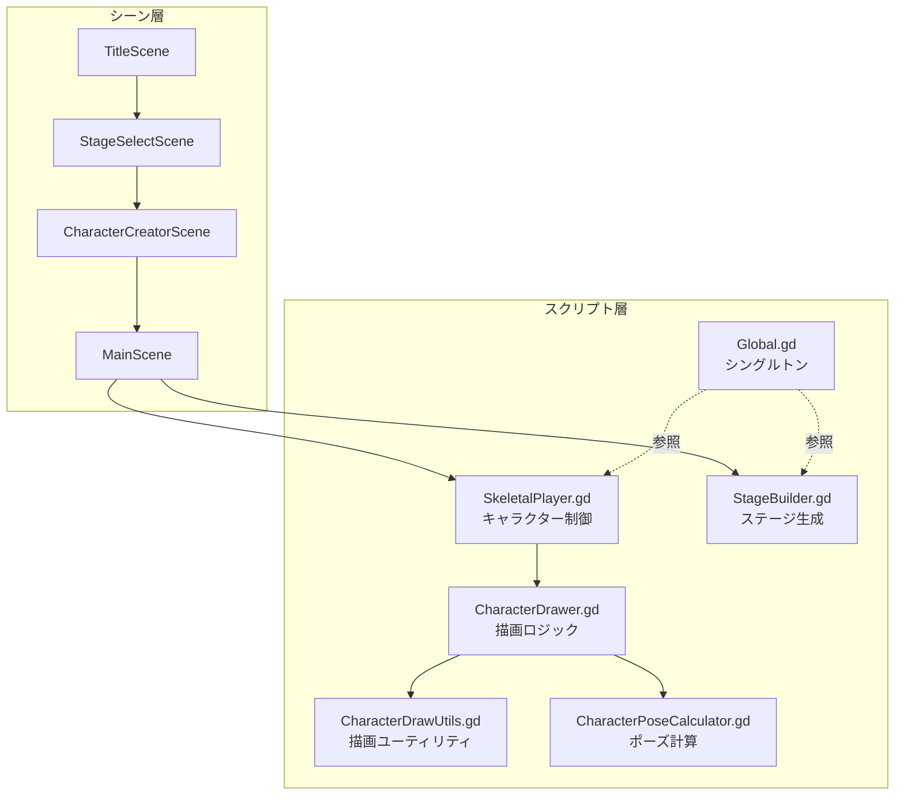

# CLAUDE.md — tall_life_simulator

Claude Code 向けプロジェクト定義ファイル。会話開始時に必ず参照する。

---

## プロジェクト概要

**Tall Life Simulator** — 背の高い人の日常生活を追体験できる Godot 4.x 製ゲーム。

| 項目 | 内容 |
|---|---|
| エンジン | Godot 4.x |
| 言語 | GDScript |
| リリース先 | GitHub Pages (`docs/`) |
| ブランチ戦略 | `develop` が主幹、機能は `feat/*` で分岐 |

---

## アーキテクチャ図



---

## ディレクトリ構成

```
tall_life_simulator/
├── godot-project/          # Godot プロジェクト本体
│   ├── scenes/             # .tscn シーンファイル
│   ├── scripts/            # .gd スクリプト
│   └── project.godot
├── docs/                   # GitHub Pages (ビルド成果物)
├── assets/                 # 素材ファイル
└── specs/                  # 仕様書
```

---

## 開発ルール

### 基本
- **すべて日本語で応答する**
- 思考プロセスも日本語で表示する
- `docs/` は GitHub Pages 用。直接編集しない
- `*.local.md` はローカルメモ。Git にコミットしない

### コミット規約
```
feat: メッセージ（日本語）

Co-Authored-By: Claude Sonnet 4.6 <noreply@anthropic.com>
```

- prefix: `feat` / `fix` / `refactor` / `docs` / `chore`
- コミット前に必ず動作確認を行う

### ファイル編集の優先度
1. **既存ファイルを編集** — 新規ファイルは必要最小限に
2. **変更は最小スコープ** — 要求外の改善は行わない
3. **セキュリティ** — GDScript でも外部入力のバリデーションに注意

---

## AI エージェントのメモ管理

| ファイル | 用途 | 編集権限 |
|---|---|---|
| `plan_by_agent.md` | AI が自由に使うメモ帳 | AI が編集可 |
| `spec.local.md` | ユーザのメモ | **編集不可** |
| `CLAUDE.md` | このファイル | 必要時のみ更新 |

---

## よく使うコマンド

```bash
# Godot プロジェクトをコマンドラインで実行（パスは環境依存）
godot --path godot-project/

# Git: 機能ブランチ作成
git checkout develop && git pull && git checkout -b feat/XXX
```

---

## 会話分割の指針（効率化）

各会話は **1タスク1会話** を原則とする。以下を目安に分割する：

- シーン追加・変更
- バグ修正
- スクリプトのリファクタリング
- 仕様確認・設計相談

会話開始時に「今回のスコープ」を一言で宣言してから作業を始める。
