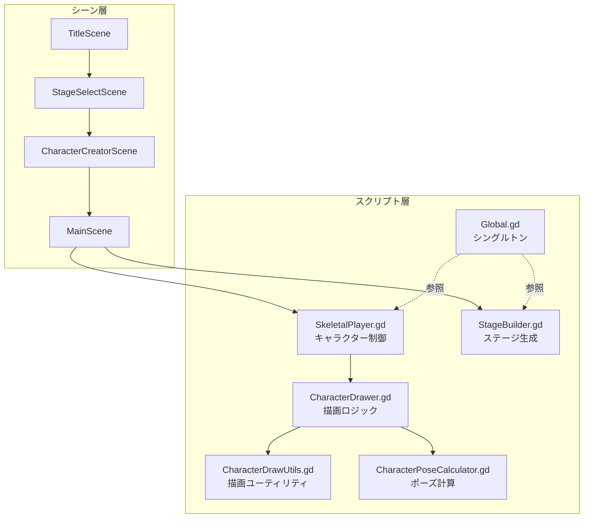
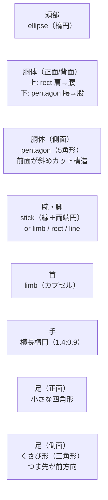

# CLAUDE.md — tall_life_simulator

Claude Code 向けプロジェクト定義ファイル。会話開始時に必ず参照する。

---

## 一般的な要望

- 複雑な処理はsubagentを使ってください

## プロジェクト概要

**Tall Life Simulator** — 背の高い人の日常生活を追体験できる Godot 4.x 製ゲーム。

| 項目 | 内容 |
|---|---|
| エンジン | Godot 4.x |
| 言語 | GDScript |
| リリース先 | GitHub Pages (`docs/`) |
| ブランチ戦略 | `develop` が主幹、機能は `feat/*` で分岐 |

---

## アーキテクチャ図



---

## キャラクター描画システム

> 詳細仕様: [specs/character_drawing_system.md](specs/character_drawing_system.md)

### 責務分担

| スクリプト | パス | 責務 |
|---|---|---|
| `CharacterPoseCalculator.gd` | `godot-project/scripts/CharacterPoseCalculator.gd` | 歩行フェーズ・プロポーション(`m`)から関節座標(`cx`,`hy`等)と角度を計算 |
| `CharacterDrawer.gd` | `godot-project/scripts/CharacterDrawer.gd` | 骨格データを受け取り `part_shapes` に従ってパーツを描画 |
| `CharacterDrawUtils.gd` | `godot-project/scripts/CharacterDrawUtils.gd` | `draw_polygon` / `draw_circle` 等の純粋な描画ユーティリティ |
| `SkeletalPlayer.gd` | `godot-project/scripts/SkeletalPlayer.gd` | キャラクター制御・入力処理 |
| `Global.gd` | `godot-project/scripts/Global.gd` | シングルトン・グローバル状態 |
| `StageBuilder.gd` | `godot-project/scripts/StageBuilder.gd` | ステージ生成ロジック |

### part_shapes（パーツ形状定義）

```gdscript
var part_shapes = {
    "head":               "ellipse",
    "torso_lower":        "trapezoid",
    "torso_upper":        "trapezoid",
    "torso_front_lower":  "pentagon",   # 股の表現（下に頂点が突き出た5角形）
    "torso_front_upper":  "rect",
    "limb":               "stick",
    "neck":               "limb",
}
```

### パーツ別形状まとめ



**側面胴体の構造メモ:**
- 厚み = 頭の横幅 × 0.85（一定）
- 背面: 垂直直線
- 前面: 肩前端〜乳首高さまで斜めカット → 以下垂直
- 関節後端 = 頭部中心縦軸(`hx`)に揃える

### 拡張手順

1. `CharacterDrawUtils.gd` に `draw_***()` 関数を追加
2. `CharacterDrawer.gd` の描画分岐に `elif shape == "..."` を追加

---

## ディレクトリ構成

```
tall_life_simulator/
├── godot-project/          # Godot プロジェクト本体
│   ├── scenes/             # .tscn シーンファイル
│   ├── scripts/            # .gd スクリプト
│   └── project.godot
├── docs/                   # GitHub Pages (ビルド成果物)
├── assets/                 # 素材ファイル
└── specs/                  # 仕様書
```

---

## 開発ルール

### 基本
- **すべて日本語で応答する**
- 思考プロセスも日本語で表示する
- `docs/` は GitHub Pages 用。直接編集しない
- `*.local.md` はローカルメモ。Git にコミットしない

### コミット規約
```
feat: メッセージ（日本語）

Co-Authored-By: Claude Sonnet 4.6 <noreply@anthropic.com>
```

- prefix: `feat` / `fix` / `refactor` / `docs` / `chore`
- コミット前に必ず動作確認を行う

### ファイル編集の優先度
1. **既存ファイルを編集** — 新規ファイルは必要最小限に
2. **変更は最小スコープ** — 要求外の改善は行わない
3. **セキュリティ** — GDScript でも外部入力のバリデーションに注意

---

## AI エージェントのメモ管理

| ファイル | 用途 | 編集権限 |
|---|---|---|
| `plan_by_agent.md` | AI が自由に使うメモ帳 | AI が編集可 |
| `spec.local.md` | ユーザのメモ | **編集不可** |
| `CLAUDE.md` | このファイル | 必要時のみ更新 |

---

## よく使うコマンド

```bash
# Godot プロジェクトをコマンドラインで実行（パスは環境依存）
godot --path godot-project/

# Git: 機能ブランチ作成
git checkout develop && git pull && git checkout -b feat/XXX
```

---

## 会話分割の指針（効率化）

各会話は **1タスク1会話** を原則とする。以下を目安に分割する：

- シーン追加・変更
- バグ修正
- スクリプトのリファクタリング
- 仕様確認・設計相談

会話開始時に「今回のスコープ」を一言で宣言してから作業を始める。
